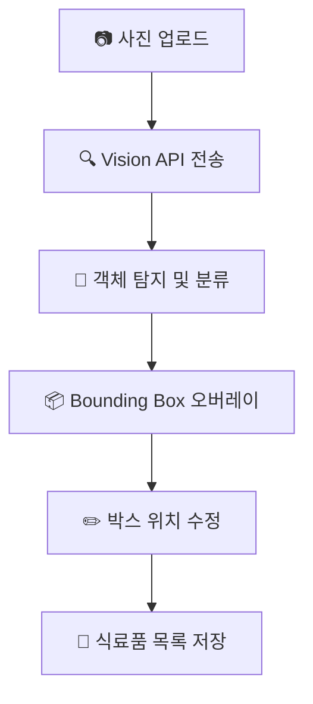

# RefrigerAI - 스마트 냉장고 식료품 인식 및 관리 시스템

> 스마트폰 카메라로 냉장고를 촬영하면 AI가 식료품을 자동 인식하여 관리해주는 서비스

## 이 프로젝트는?

스마트폰 카메라로 냉장고 내부를 촬영하면, Google Vision API를 활용하여 사진 속 식료품을 자동으로 인식합니다. 인식된 식료품은 YOLO 스타일의 Bounding Box로 시각화되며, 사용자가 직접 위치를 수정할 수 있습니다. 최종 확정된 식료품 목록은 저장되어 냉장고 현황을 직관적으로 파악할 수 있습니다.

## 목표

- [x] 이미지 업로드 및 미리보기 기능 구현
- [ ] Google Vision API 연동을 통한 객체 탐지
- [ ] YOLO 스타일 Bounding Box 시각화
- [ ] Confidence Score 표시
- [ ] 객체 박스 드래그 및 위치 수정 기능
- [ ] 식료품 목록 데이터 저장

## 기술 스택

| 영역      | 기술                    | 선택 이유                                   |
| --------- | ----------------------- | ------------------------------------------- |
| Frontend  | Next.js + React         | 빠른 개발, SSR 지원, Canvas/SVG 렌더링 용이 |
| UI/UX     | Tailwind CSS            | 반응형 디자인, 빠른 스타일링                |
| Canvas    | Fabric.js 또는 Konva.js | Bounding Box 렌더링 및 드래그 인터랙션      |
| Backend   | Next.js API Routes      | Serverless 함수로 Vision API 연동           |
| AI/Vision | Google Vision API       | Object Localization 기능 활용               |
| Database  | Supabase / Firebase     | 실시간 동기화, 간편한 인증                  |
| 배포      | Vercel                  | Next.js 최적화, 무료 호스팅                 |

## 문서 목록

| 문서                                            | 설명                            | 상태 |
| ----------------------------------------------- | ------------------------------- | :--: |
| [01_SERVICE_OVERVIEW](./01_SERVICE_OVERVIEW.md) | 서비스 개요 및 사용자 흐름      |  ✅  |
| [02_FEATURES](./02_FEATURES.md)                 | 기능 명세                       |  ✅  |
| [03_DATABASE](./03_DATABASE.md)                 | DB 구조 (식료품, 사용자)        |  ✅  |
| [04_API](./04_API.md)                           | API 설계 (Vision API 연동 포함) |  ✅  |
| [05_UI_STRUCTURE](./05_UI_STRUCTURE.md)         | UI 구조 및 컴포넌트 설계        |  ✅  |
| [99_DECISIONS](./99_DECISIONS.md)               | 기술 결정 기록                  |  ✅  |

## 핵심 사용자 흐름



## 시작하려면

```bash
# 의존성 설치
npm install

# 환경 변수 설정
cp .env.example .env.local
# .env.local에 GOOGLE_VISION_API_KEY 설정

# 개발 서버 실행
npm run dev
```

## 프로젝트 현황

- 📊 진행 상황: [PROGRESS.md](../PROGRESS.md)
- 📝 세션 기록: [SESSION_LOG.md](../SESSION_LOG.md)
- ✅ 할 일: [TODO.md](../TODO.md)

## 향후 확장 계획

| 기능          | 설명                         | 우선순위 |
| ------------- | ---------------------------- | :------: |
| 유통기한 관리 | 유통기한 추정 및 알림        | 🔴 높음  |
| 중복 병합     | 중복 식료품 자동 병합        | 🟡 중간  |
| 레시피 추천   | 현재 식료품 기반 레시피 추천 | 🟡 중간  |
| 자체 모델     | YOLO 등 자체 모델로 교체     | 🔵 낮음  |

---

_최종 업데이트: 2026-01-23_
