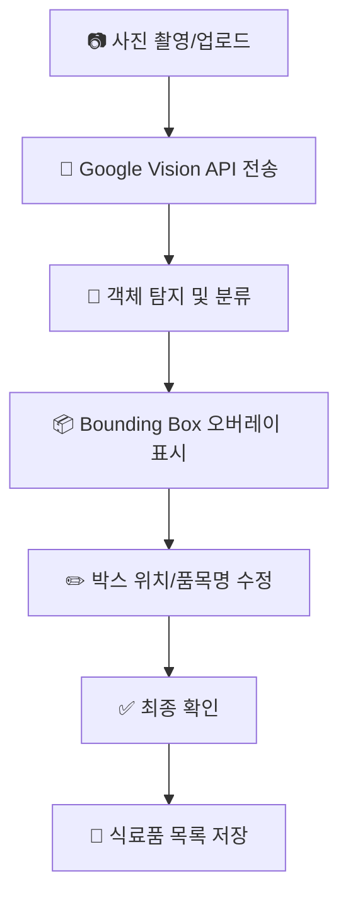

# 서비스 개요

## 서비스 소개

**RefrigerAI**는 스마트폰 카메라로 냉장고 내부를 촬영하면, AI가 사진 속 식료품을 자동으로 인식하여 현재 냉장고에 어떤 식료품이 있는지 시각적으로 보여주고 저장하는 서비스입니다. 수동 입력 없이 자동으로 식료품을 등록하여 식재료 관리의 번거로움을 줄여줍니다.

## 타겟 사용자

| 사용자 유형      | 설명                        | 주요 니즈                                 |
| ---------------- | --------------------------- | ----------------------------------------- |
| 자취생/1인 가구  | 냉장고 관리가 번거로운 사람 | 간편한 식료품 현황 파악, 음식물 낭비 방지 |
| 바쁜 직장인      | 시간이 부족한 사람          | 빠른 식료품 등록, 장보기 편의             |
| 요리 애호가      | 레시피에 필요한 재료 관리   | 현재 재료 기반 요리 가능 여부 파악        |
| 다인 가구 관리자 | 가족 식료품을 관리하는 사람 | 효율적인 가족 식료품 재고 관리            |

## 핵심 가치

1. **자동화**: 사진 한 장으로 식료품 자동 인식 - 수동 입력 불필요
2. **시각화**: YOLO 스타일 Bounding Box로 직관적인 탐지 결과 확인
3. **편의성**: 모바일 친화적 UX로 언제 어디서나 간편하게 사용

## 사용자 여정 (User Flow)

**상세 흐름**:

1. 사용자가 스마트폰 또는 웹에서 **사진 업로드**
2. 업로드된 사진을 **Google Vision API**로 전송
3. Vision API가 사진 내 **객체(Object) 탐지 및 분류**
4. 탐지 결과를 기반으로 화면에 렌더링:
   - 원본 사진 표시
   - YOLO 스타일의 **Bounding Box** 오버레이 표시
   - 각 박스 상단에 **품목명(Label) + 신뢰도(Confidence)** 표시
5. 사용자는 객체 박스를 **드래그하여 위치 보정** 가능
6. 최종 확정된 식료품 목록을 **저장**

## 유사 서비스 / 레퍼런스

| 서비스          | URL             | 참고할 점                      |
| --------------- | --------------- | ------------------------------ |
| 삼성 Family Hub | samsung.com     | 스마트 냉장고 내부 카메라 활용 |
| Fridgely        | fridgely.com    | 냉장고 재고 관리 앱 UX         |
| Whisk           | whisk.com       | 레시피-재료 연동 기능          |
| Google Lens     | lens.google.com | 객체 인식 UI/UX                |

## 차별점

- **전용 하드웨어 불필요**: 기존 스마트폰만으로 사용 가능
- **실시간 객체 시각화**: YOLO 스타일 Bounding Box로 인식 결과 즉시 확인
- **사용자 수정 가능**: 잘못된 인식 결과를 드래그로 쉽게 수정
- **확장 가능한 구조**: 유통기한 관리, 레시피 추천 등으로 확장 용이

## 수익 모델 (해당시)

| 모델        | 설명                                      |
| ----------- | ----------------------------------------- |
| Freemium    | 기본 기능 무료, 프리미엄 기능 유료 전환   |
| 구독 서비스 | 월정액으로 무제한 인식 + 레시피 추천 기능 |
| API 제공    | B2B 대상 식료품 인식 API 서비스           |

## MVP 범위

### 포함 ✅

- 이미지 업로드 및 미리보기
- Google Vision API 기반 객체 탐지
- Bounding Box 시각화 (Canvas/SVG)
- Confidence Score 표시
- 객체 박스 드래그 및 위치 수정
- 식료품 목록 저장 (로컬 또는 DB)

### 제외 ❌ (이후 버전)

- 유통기한 추정 및 알림
- 중복 식료품 자동 병합
- 레시피 추천 연동
- 사용자 인증 및 로그인
- 다중 냉장고 관리
- 자체 AI 모델 (YOLO 등)

---

_최종 업데이트: 2026-01-23_
