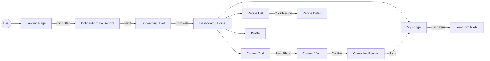
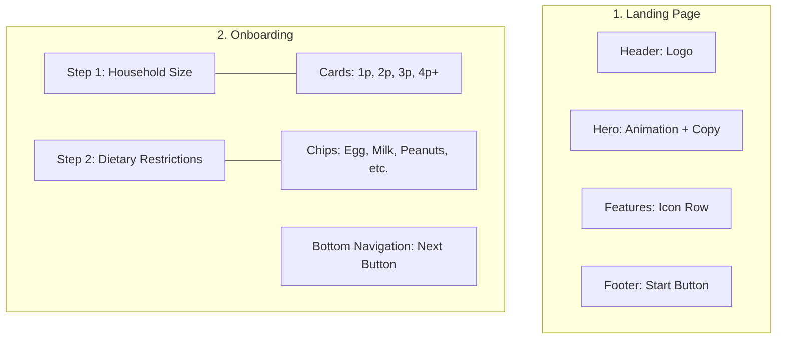

# UI Structure & Composition Diagram

This document visualizes the UI structure and component hierarchy based on the wireframes using Mermaid diagrams.

## 1. High-Level Screen Flow



## 2. Detailed Screen Composition

### 🏠 Landing & Onboarding



### 📱 Main Application

```mermaid
graph TD
    subgraph Dashboard ["3. Dashboard (Home)"]
        D_Header[Header: Greeting + Noti]
        D_Status[Status Card: Gauge + Alerts]
        D_Category[Category Menu: Fridge/Freezer/Pantry/Condiments]
        D_RecRecipes[Recommend: Recipe Card Carousel]
        D_Nav[Global Tab Bar]
    end

    subgraph Inventory ["4. My Fridge"]
        I_Header[Header: Title + Search]
        I_Filter[Filter Tabs: All/Expiry/RegDate]
        I_List[Item List: Icon + Name + D-Day]
        I_Empty[Empty State: Dashed Box + Camera Icon]
        I_FAB[Floating Action Button (+)]
    end

    subgraph Camera_Flow ["5. Camera & Add"]
        C_View[Camera Viewfinder]
        C_Overlay[Overlay: Guide Box + Controls]
        C_Correction[Review List: Edit Name/Qty/Date]
        C_Manual[Link: Add Manually]
    end

    subgraph Recipe_Detail ["6. Recipe Detail"]
        R_Hero[Hero Image + Title + Rating]
        R_Meta[Info Bar: Time/Diff/Portion]
        R_Ing[Ingredients: Check/Cross List + Buy Btn]
        R_Steps[Cooking Steps]
        R_Action[Footer: Start Cooking Btn]
    end
```

## 3. Component Hierarchy

- **Layout**
  - `TopAppBar` (Logo/Title, Actions)
  - `BottomNavigationBar` (Home, Fridge, Add, Recipe, Profile)
- **Common Elements**
  - `Button` (Primary: Green, Secondary: Outline)
  - `Card` (Shadowed containers)
  - `Chip` (Selection tags)
- **Feature Modules**
  - **Inventory**
    - `StatusGauge` (Progress bar)
    - `StorageCategoryIcon`
    - `GroceryItemRow` (Swipeable)
  - **Recipe**
    - `RecipeThumbnailCard`
    - `IngredientRow` (Status: In-stock/Missing)
