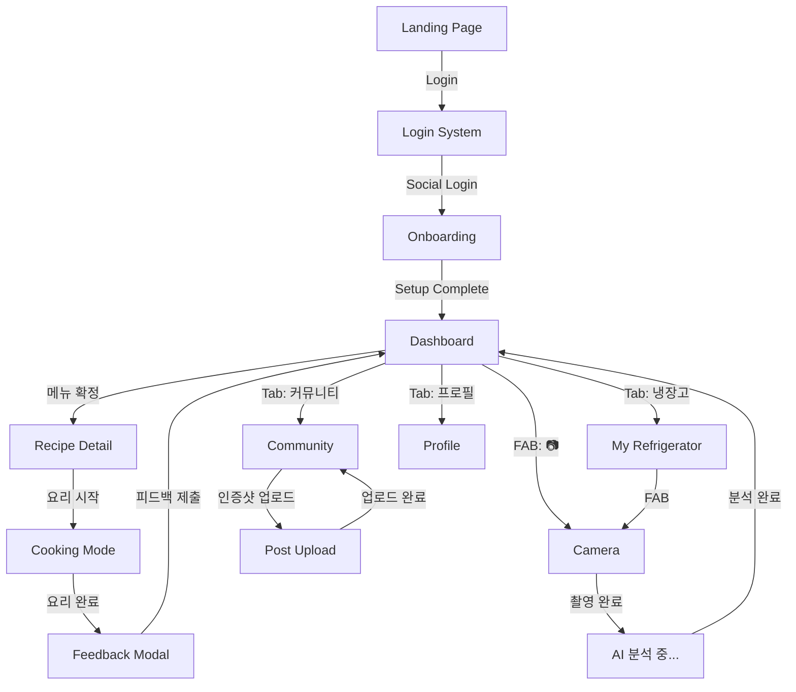

# 먹이 (Meok-i) - Wireframes & UI/UX 시안

> **버전**: V3.0  
> **기반 문서**: PRD 수정본 (2026-01-30)  
> **최신 업데이트**: 2026-01-30  
> **핵심 철학**: 입력 최소화 · 선택지 최소화 · AI 결정 대행

---

## 1. User Flow Diagram



---

## 2. Screen Designs

### 2.1 랜딩 페이지 (Landing Page)


| 영역 | 컴포넌트 | 상세 설명 |
|:---|:---|:---|
| **Header** | 로고 | "먹이" 텍스트 + 냉장고➡️접시 심볼 |
| **Hero Section** | 일러스트 | 냉장고 사진 → AI가 메뉴 결정하는 애니메이션 |
| **Headline** | 메인 카피 | "오늘 뭐 먹지? AI가 대신 결정해줄게" |
| **Sub-copy** | 부제 | "사진 한 장으로, 3초 만에 오늘의 메뉴 확정" |
| **Features** | 아이콘 3개 | 📷 촬영만 하면 끝 / 🤖 AI가 결정 / 🍳 바로 요리 시작 |
| **CTA** | 버튼 | "시작하기" (Primary Color, Full-width, Sticky Bottom) |

**인터랙션:**
- "시작하기" 클릭 → 로그인 화면으로 이동
- 스크롤 시 Features 영역 Fade-in 애니메이션
- Hero 일러스트 자동 반복 애니메이션

---

### 2.2 로그인 시스템 (Login System)


| 영역 | 컴포넌트 | 상세 설명 |
|:---|:---|:---|
| **Header** | 로고 | "먹이" 로고 (중앙 정렬, 대형) |
| **Tagline** | 텍스트 | "결정은 AI에게 맡기세요" |
| **Social Login** | 버튼 그룹 | 카카오 (노란색) / 네이버 (초록색) / Google (흰색) |
| **Divider** | 구분선 | "또는" 텍스트 |
| **Guest** | 텍스트 링크 | "둘러보기" (비로그인 체험 모드) |
| **Terms** | 텍스트 | "시작 시 이용약관 및 개인정보처리방침에 동의합니다" |

**인터랙션:**
- 소셜 로그인 버튼 클릭 → 해당 OAuth 플로우 시작
- 첫 로그인 시 → 온보딩으로 이동
- 기존 사용자 → 대시보드로 이동
- "둘러보기" → 제한된 기능으로 앱 체험

---

### 2.3 온보딩 (Onboarding)


#### Step 1: 구성원 수 선택
| 영역 | 컴포넌트 | 상세 설명 |
|:---|:---|:---|
| **Progress** | Dot Indicator | 현재 Step 1/3 표시 |
| **Title** | 질문 | "몇 명을 위한 식사를 준비하시나요?" |
| **Options** | Card Grid (2x2) | 1인 🧑 / 2인 👫 / 3인 👨‍👩‍👧 / 4인+ 👨‍👩‍👧‍👦 |
| **Button** | Primary | "다음" (선택 시 활성화) |

#### Step 2: 알러지/기피 식재료
| 영역 | 컴포넌트 | 상세 설명 |
|:---|:---|:---|
| **Progress** | Dot Indicator | 현재 Step 2/3 표시 |
| **Title** | 질문 | "피해야 할 재료가 있나요?" |
| **Options** | Tag Cloud | 계란 🥚 / 우유 🥛 / 땅콩 🥜 / 해산물 🦐 / 밀 🌾 / 대두 (Pill 형태, 다중 선택) |
| **Skip** | 텍스트 링크 | "건너뛰기" (상단 우측) |
| **Button** | Primary | "다음" |

#### Step 3: 선호 스타일
| 영역 | 컴포넌트 | 상세 설명 |
|:---|:---|:---|
| **Progress** | Dot Indicator | 현재 Step 3/3 표시 |
| **Title** | 질문 | "평소 선호하는 요리 스타일은?" |
| **Options** | Card List | ⚡ 간단한 요리 / 👨‍🍳 제대로 된 요리 / 🥗 건강한 요리 / 🍖 든든한 요리 |
| **Button** | Primary | "시작하기" |

**인터랙션:**
- 카드/태그 선택 시 Primary Border + Checkmark 표시
- "건너뛰기" 시 기본값으로 설정
- "시작하기" 클릭 → 카메라 화면으로 첫 촬영 유도

---

### 2.4 카메라 (Camera)


#### Camera View
| 영역 | 컴포넌트 | 상세 설명 |
|:---|:---|:---|
| **Close** | 아이콘 | 좌측 상단 X 버튼 |
| **Viewfinder** | Full Screen | 카메라 프리뷰 (반투명 가이드 프레임 오버레이) |
| **Guide Text** | Overlay | "냉장고 내부가 잘 보이게 찍어주세요 📷" |
| **Tip** | 텍스트 | "문을 활짝 열고 전체가 보이게 찍으면 더 정확해요" |
| **Shutter** | Button | 하단 중앙 원형 버튼 (White, 80px) |
| **Flash** | Icon | 좌측 하단 ⚡ 아이콘 (Toggle) |
| **Gallery** | Icon | 우측 하단 🖼️ 아이콘 (갤러리에서 선택) |

#### Loading State
| 영역 | 컴포넌트 | 상세 설명 |
|:---|:---|:---|
| **Animation** | Lottie | AI 분석 애니메이션 (냉장고→식재료 추출 비주얼) |
| **Title** | 텍스트 | "AI가 재료를 분석 중이에요..." |
| **Progress** | Progress Bar | 예상 시간 표시 (약 3초) |

#### Correction View
| 영역 | 컴포넌트 | 상세 설명 |
|:---|:---|:---|
| **Preview** | Thumbnail | 상단에 촬영된 이미지 (클릭 시 확대) |
| **Detected Items** | Editable List | [아이콘] [품목명 Input] [수량 Counter] [X 삭제] |
| **Add Button** | Text Link | "+ 직접 추가하기" (리스트 하단) |
| **Confirm** | Sticky Button | "저장하고 메뉴 추천받기" (Primary, Full-width) |

**인터랙션:**
- 셔터 클릭 → 로딩 → AI 분석 → Correction View
- 품목명/수량 직접 수정 가능
- X 버튼 → 해당 아이템 삭제
- "+ 직접 추가하기" → 빈 Row 추가
- "저장하고 메뉴 추천받기" → 대시보드로 이동

---

### 2.5 대시보드 (Dashboard) ⭐ 핵심 화면


> **MVP 성공의 핵심**: AI가 결정한 메뉴를 "수락"하는 경험

| 영역 | 컴포넌트 | 상세 설명 |
|:---|:---|:---|
| **Header** | Greeting | "태규님, 오늘의 메뉴를 골랐어요 👨‍🍳" |
| **AI Badge** | Label | "AI 추천" (Purple Badge) |
| **1순위 카드** | Hero Card | 대형 카드 (요리 이미지 Full-width + 요리명 + "1순위" 배지) |
| **Explanation** | Text Card | "유통기한이 임박한 우유(D-2)와 계란(D-5)을 활용해요" |
| **Action** | Primary CTA | "이 메뉴로 결정!" (Primary, Large, Full-width) |
| **Alternatives** | Sub Cards | 2순위, 3순위 작은 카드 (가로 배치, 60% 크기) |
| **Refresh** | Text Link | "다른 추천 받기 (2/3 남음)" |
| **Bottom Nav** | Tab Bar | 🏠 홈 / 🧊 냉장고 / 📷 촬영 / 💬 커뮤니티 / 👤 프로필 |

**1순위 카드 상세:**
```
┌─────────────────────────────────────┐
│ [요리 이미지 - Full Width]         │
│                                     │
│ 🥇 1순위                            │
│ 계란 프라이 덮밥                    │
│                                     │
│ ⏱️ 15분 · 🔥 쉬움 · 👤 1인분      │
└─────────────────────────────────────┘

"유통기한이 임박한 우유(D-2)와 계란(D-5)을 
활용할 수 있어요. 조리 시간도 짧아 딱이에요!"

[ 🍳 이 메뉴로 결정! ]
```

**인터랙션:**
- 1순위 카드 클릭 → 레시피 상세 페이지
- "이 메뉴로 결정!" → 레시피 상세 → 요리 모드
- 2순위/3순위 클릭 → 해당 레시피 상세
- "다른 추천 받기" → 새로운 3개 메뉴 (일일 3회 제한)
- FAB 📷 → 카메라 화면

---

### 2.6 나의 냉장고 (My Refrigerator)


| 영역 | 컴포넌트 | 상세 설명 |
|:---|:---|:---|
| **Header** | Title + Search | "나의 냉장고" + 🔍 검색 아이콘 |
| **Summary Card** | Status | "🧊 15개 재료 보유 · ⚠️ 3개 소비 권장" |
| **Category Tabs** | Filter | 전체 / 냉장 ❄️ / 냉동 🧊 / 실온 🏠 / 조미료 🧂 |
| **Sort** | Dropdown | 유통기한순 / 등록순 / 가나다순 |
| **Item List** | Row | [식품 Emoji] + [이름] + [D-day Badge] + [수량] |
| **D-day Badge** | Label | D-2 (Red), D-7 (Orange), D-14 (Yellow), D-14+ (Gray) |
| **Swipe Action** | Hidden Buttons | ← 스와이프 시 [수정] [삭제] 버튼 노출 |
| **Empty State** | Placeholder | 점선 박스 + 📷 아이콘 + "사진을 찍어 채워보세요" |
| **FAB** | Floating Button | 📷 카메라 아이콘 |

**리스트 아이템 상세:**
```
┌────────────────────────────────────┐
│ 🥚 계란           D-5    6개     > │
├────────────────────────────────────┤
│ 🥛 우유           D-2    1개     > │  ← 빨간색 배경
├────────────────────────────────────┤
│ 🥬 양배추         D-10   1개     > │
└────────────────────────────────────┘
```

**인터랙션:**
- 아이템 탭 → 수정 모달 (이름, 수량, 유통기한)
- 좌측 스와이프 → 수정/삭제 액션 버튼
- Empty State 클릭 → 카메라 화면
- FAB → 카메라 화면

---

### 2.7 레시피 상세 페이지 (Recipe Detail)


| 영역 | 컴포넌트 | 상세 설명 |
|:---|:---|:---|
| **Hero** | Image | 요리 완성 사진 (Full-width, Parallax) |
| **Back** | Icon | ← 뒤로가기 (좌측 상단) |
| **Share** | Icon | 공유 (우측 상단) |
| **Title** | Heading | "계란 프라이 덮밥" |
| **AI Badge** | Label | "🤖 AI 95% 확신" (Purple) |
| **Info Bar** | Icons | ⏱️ 15분 / 🔥 난이도 쉬움 / 👤 1인분 |
| **AI Reason** | Card | "📌 추천 이유: 우유(D-2), 계란(D-5) 소비 + 빠른 조리 시간" |
| **Ingredients** | Checklist | ✓ 계란 2개 (보유, Green) / ✓ 밥 1공기 (보유) / ✗ 쪽파 (부족, Gray) |
| **Steps** | Ordered List | Step 1: 이미지 + 설명 / Step 2: ... |
| **Timer** | Button | 각 Step에 ⏱️ 타이머 버튼 (필요시) |
| **CTA** | Sticky Button | "🍳 요리 시작하기" (Primary, Full-width) |

**AI 추천 이유 카드:**
```
┌─────────────────────────────────────┐
│ 📌 AI가 이 메뉴를 추천한 이유       │
├─────────────────────────────────────┤
│ • 유통기한 임박: 우유(D-2), 계란(D-5) │
│ • 조리 시간: 15분으로 간단해요       │
│ • 취향 매칭: 간단한 요리 선호        │
└─────────────────────────────────────┘
```

**인터랙션:**
- "요리 시작하기" → 화면 꺼짐 방지 + Step-by-step 쿠킹 모드
- 부족 재료 클릭 → "없어도 괜찮아요" 또는 "장보기 추가"
- 쿠킹 모드 완료 → 피드백 모달 자동 팝업

---

### 2.8 프로필 (Profile)


| 영역 | 컴포넌트 | 상세 설명 |
|:---|:---|:---|
| **User Card** | Profile | 프로필 이미지 + 닉네임 + "먹이 사용 15일째" |
| **Stats Card** | Metrics | AI 결정 수락률: 72% 📈 / 요리 완료: 23회 🍳 / 절약한 재료: 45개 ♻️ |
| **Achievement** | Badge | "결정 마스터 🏆" (수락률 70% 이상 시) |
| **Settings** | Menu List | 👥 가족 구성원 / 🚫 알러지 설정 / 🍽️ 요리 스타일 / 🔔 알림 설정 |
| **Account** | Menu List | 로그아웃 / 회원탈퇴 / 버전 정보 / 문의하기 |

**통계 카드 상세:**
```
┌─────────────────────────────────────┐
│        나의 먹이 통계 📊            │
├───────────┬───────────┬─────────────┤
│   72%     │   23회    │    45개     │
│ AI 수락률 │ 요리 완료  │ 절약 재료   │
└───────────┴───────────┴─────────────┘
```

**인터랙션:**
- 각 설정 메뉴 탭 → 해당 설정 화면
- 통계 카드 탭 → 상세 통계 페이지 (추후)

---

### 2.9 피드백 수집 모달 (Feedback Modal)


> 요리 완료 후 자동 팝업 (Bottom Sheet 형태)

| 영역 | 컴포넌트 | 상세 설명 |
|:---|:---|:---|
| **Handle** | Drag Handle | 상단 중앙 가로 바 |
| **Title** | 질문 | "오늘 추천, 어떠셨나요?" |
| **Emoji Rating** | 선택지 (가로 배치) | 😍 맛있었어요 / 😐 보통이에요 / 😕 별로였어요 |
| **Follow-up** | 추가 질문 | (별로 선택 시) "어떤 점이 아쉬웠나요?" |
| **Options** | Tag Multi-select | 재료 부족 / 난이도 높음 / 취향 아님 / 시간 부족 / 맛이 별로 |
| **Comment** | Text Input | "더 하고 싶은 말이 있다면..." (Optional) |
| **Submit** | Button | "피드백 보내기" (Primary) |
| **Skip** | Text Link | "다음에 할게요" |

**레이아웃:**
```
┌─────────────────────────────────────┐
│            ━━━━━━━━                 │  ← Drag Handle
│                                     │
│    오늘 추천, 어떠셨나요? 🤔        │
│                                     │
│   😍          😐          😕        │
│ 맛있었어요   보통이에요   별로였어요 │
│                                     │
│  ─ ─ ─ ─ ─ ─ ─ ─ ─ ─ ─ ─ ─ ─ ─ ─  │
│  어떤 점이 아쉬웠나요? (다중 선택)   │
│                                     │
│  [재료부족] [난이도↑] [취향❌]      │
│  [시간부족] [맛별로]                │
│                                     │
│  더 하고 싶은 말이 있다면...        │
│  ┌─────────────────────────────┐   │
│  │                             │   │
│  └─────────────────────────────┘   │
│                                     │
│  [      피드백 보내기      ]        │
│         다음에 할게요               │
└─────────────────────────────────────┘
```

**인터랙션:**
- Emoji 선택 시 시각적 피드백 (크기 확대, 색상 변경)
- 😕 선택 시 → Follow-up 질문 영역 슬라이드 노출
- "피드백 보내기" → 감사 토스트 + 모달 닫힘
- "다음에 할게요" → 모달 닫힘 (피드백 미수집으로 기록)

---

### 2.10 커뮤니티 (Community)


| 영역 | 컴포넌트 | 상세 설명 |
|:---|:---|:---|
| **Header** | Title + Bell | "커뮤니티" + 🔔 알림 아이콘 |
| **Tabs** | Tab Bar | 전체 / 🔥 인기 / 👥 팔로잉 |
| **Post Card** | Feed Item | 요리 이미지 + 유저 정보 + "먹이 추천" 뱃지 + 설명 |
| **Meoki Badge** | Label | "🤖 먹이 추천으로 만듦" (AI 추천 메뉴인 경우) |
| **Engagement** | Icons | ❤️ 좋아요 수 + 💬 댓글 수 |
| **FAB** | Floating Button | ✏️ 인증샷 올리기 |

**피드 카드 상세:**
```
┌─────────────────────────────────────┐
│ 👤 요리초보맘 · 2시간 전            │
├─────────────────────────────────────┤
│ [요리 완성 사진 - Full Width]       │
│                                     │
├─────────────────────────────────────┤
│ 🤖 먹이 추천으로 만듦               │ ← AI로 만든 경우
│                                     │
│ "냉장고에 있던 재료로 뚝딱!         │
│  먹이 덕분에 고민 없이 만들었어요"  │
│                                     │
│ ❤️ 24   💬 5                        │
└─────────────────────────────────────┘
```

**인터랙션:**
- 카드 탭 → 상세 보기 (댓글 포함)
- ❤️ 탭 → 좋아요 토글
- FAB → 인증샷 업로드 화면
- "먹이 추천으로 만듦" 뱃지 탭 → 해당 레시피 보기

---

## 3. Design Tokens

| Token | Value | Usage |
|:---|:---|:---|
| `--color-primary` | `#10B981` | CTA 버튼, 성공 상태, FAB |
| `--color-secondary` | `#F59E0B` | 경고 (D-7 이하), 강조 |
| `--color-danger` | `#EF4444` | 유통기한 임박 (D-3 이하), 에러 |
| `--color-ai` | `#8B5CF6` | AI 배지, AI 관련 강조 |
| `--color-background` | `#FFFFFF` | 기본 배경 |
| `--color-surface` | `#F9FAFB` | 카드 배경 |
| `--color-text-primary` | `#111827` | 본문 텍스트 |
| `--color-text-secondary` | `#6B7280` | 보조 텍스트 |
| `--font-family` | `Pretendard` | 전체 타이포그래피 |
| `--radius-card` | `16px` | 카드 모서리 |
| `--radius-button` | `12px` | 버튼 모서리 |
| `--spacing-page` | `20px` | 페이지 좌우 패딩 |

---

## 4. Bottom Navigation

모든 주요 화면에서 공통으로 사용되는 하단 네비게이션:

```
┌─────┬─────┬─────┬─────┬─────┐
│ 🏠  │ 🧊  │ 📷  │ 💬  │ 👤  │
│ 홈  │냉장고│ 촬영 │커뮤니티│프로필│
└─────┴─────┴─────┴─────┴─────┘
```

- **홈**: 대시보드 (AI 메뉴 추천)
- **냉장고**: 나의 냉장고 (재료 관리)
- **촬영**: 카메라 (중앙, 강조)
- **커뮤니티**: 인증샷 피드
- **프로필**: 설정 및 통계

---

## 5. Responsive Breakpoints

| Breakpoint | Width | Layout |
|:---|:---|:---|
| **Mobile (Default)** | < 768px | 단일 컬럼, Full-width 카드 |
| **Tablet** | 768px ~ 1024px | 2컬럼 그리드 |
| **Desktop** | > 1024px | 3컬럼 그리드, 좌측 네비게이션 고정 |

---

## 6. KPI 연동 UI 요소

PRD의 성공 지표와 직접 연동되는 UI 요소:

| KPI | 측정 UI |
|:---|:---|
| 1순위 메뉴 실행률 ≥ 50% | 대시보드 "이 메뉴로 결정!" 버튼 클릭 추적 |
| 3개 중 하나 실행률 ≥ 70% | 1/2/3순위 중 하나라도 레시피 상세→요리 시작 |
| 추가 추천 요청 ≤ 25% | "다른 추천 받기" 클릭률 |
| 추천 이유 납득률 ≥ 70% | 피드백 모달 긍정 응답 |
| 촬영→저장 ≤ 60초 | 카메라→Correction 완료 시간 측정 |

---

*이 문서는 UI 구현 시 참고용으로 사용됩니다. 실제 구현 시 디자인 시스템에 맞게 조정이 필요할 수 있습니다.*
